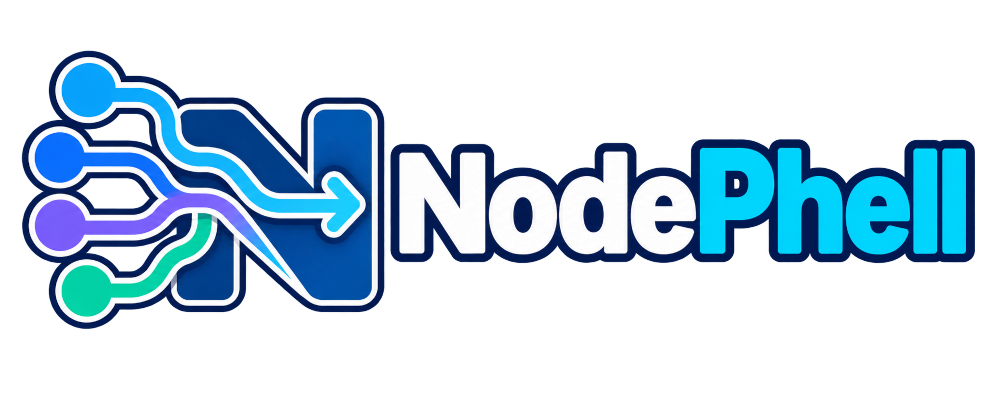

<!-- SPDX-License-Identifier: GPL-3.0-only -->



# NodePhell

No dependency hell: deterministic Python runtime and package selection without virtual environments.

NodePhell is an early-stage, general-purpose launcher and shared package store.
It is meant to prevent dependency conflicts and packages leaking between
projects. Its everyday interface is the ordinary `python` or `python3` command;
the separate `nodephell` command installs and manages what projects need.

## Intended workflow

A traditional environment workflow commonly looks like:

```text
create environment → activate it → install dependencies → run the program
```

NodePhell's intended workflow is:

```console
nodephell lock      # create pylock.toml once
nodephell install   # supply that exact lock state
python app.py       # normal use from then on
```

When `python app.py` runs, the launcher automatically discovers the project,
selects the exact locked CPython build and package releases,
constructs the package path, and starts the program. These are not recurring
environment-management steps for the user. `nodephell install` never changes
the lock; use `nodephell update` deliberately after changing requirements.

## Why not another environment?

Virtual environments and Conda-style environments associate a dependency set
with a project-specific environment that must be selected or activated.
NodePhell instead preserves compatible interpreters and exact package releases
in shared reusable stores. Project metadata describes the required combination,
and the launcher selects it automatically.

NodePhell does not create a project environment, enter a special shell, or aim
to replace Conda's native-library and system-package use cases. Outside a
recognized project, the launcher delegates to the operating system's Python
without changing its environment.

## One package copy when possible

Virtual environments commonly install another copy of the same dependency for
every project. NodePhell stores an exact downloaded wheel once for the whole
machine. Any project and Python version that can use that same wheel shares the
stored release.

Different builds are not forced together. Native wheels with different files
or hashes remain separate, and packages built from source are kept with the
Python version line and binary interface they were built for. This reduces
duplicate files without hiding incompatible packages behind one name and
version.

## Design goals

- Make `python script.py` work without activating an environment.
- Provide identical `python` and `python3` launchers.
- Select Python itself as well as Python packages from project metadata.
- Share unchanged runtimes and package releases between projects.
- Use upstream CPython and stock pip.
- Leave distribution-managed Python and PEP 668 protections intact.
- Keep `/usr/bin/python3` as an explicit distro-Python bypass.
- Keep runtime selection fixed for the life of a process.
- Support embedded-Python applications through a small general interface,
  without building application-specific rules into NodePhell's core.

See the [User guide](docs/user-guide.md) for current commands,
[Architecture](docs/architecture.md) for the detailed design,
[Embedded-host adapters](docs/host-adapters.md) for the integration boundary,
and the [Roadmap](docs/roadmap.md) for the target milestones.

## Current status

The standard-library-only prototype currently:

- discovers `pylock.toml` or `pyproject.toml` from the working directory or
  script location;
- selects an already-installed, registered CPython runtime or downloads one
  from python-build-standalone on Linux;
- locks the exact runtime archive under `[tool.nodephell.runtime]` and verifies
  its SHA-256 before extraction;
- asks stock pip for every package the project needs, including dependencies;
- creates `pylock.toml` only through an explicit `lock` or `update` command;
- installs missing exact releases in temporary directories before moving
  completed installs into the shared store;
- stores one physical copy of an exact wheel and shares it across every
  compatible project and Python version;
- keeps genuinely different wheels and source builds separate;
- records the download filename and SHA-256 beside each stored release and
  checks that identity before reuse;
- records a fingerprint of the installed files for explicit health checks;
- prevents simultaneous installs from writing the same release or combined
  package view at the same time;
- records which exact shared releases each successfully installed project uses;
- lazily records an unregistered project when an ordinary `python` launch can
  already satisfy its exact lock without downloading anything;
- lists registered projects as current, changed, or missing;
- selects ordinary packages or exact stored releases under
  `~/.python/packages/DISTRIBUTION/VERSION/DOWNLOAD/HASH`;
- combines related distributions into normal import views under
  `~/.python/pythonXY/compositions/`;
- ignores the generic Python user site during project inspection and launch,
  while keeping NodePhell's explicitly selected package view available;
- can reuse an exact locked name and version from an application's package directory
  without copying, changing, or deleting the application's files;
- launches stock CPython through the `python` and `python3` shims.

The repository also contains a separately packaged FreeCAD reference plugin.
FreeCAD is a useful test because it has an embedded Python interpreter and
compiled dependencies.
It is not part of NodePhell, and downloading or managing FreeCAD is not a core
project goal.

The host adapter can register an existing FreeCAD build, verify that its
embedded Python is compatible with the project, and pass the selected package
view through FreeCAD's supported path options. The selected view takes priority
over other Python package directories. It redirects only the generic Python
user site for that launch; FreeCAD's own module, addon, macro, preference, and
package directories remain in place. Exact locked versions in a FreeCAD-owned
package directory can be reused read-only when NodePhell does not already have
the release.

Managed interpreters and packages share one readable hierarchy:

```text
~/.python/
├── packages/DISTRIBUTION/VERSION/DOWNLOAD_FILENAME/SHA256/root/
├── projects/PROJECT_NAME-PATH_HASH.json
└── pythonXY/
    ├── interpreter/FULL_VERSION/PYTHON_ABI/DOWNLOAD_SHA256/
    └── compositions/
```

For example, an upstream 3.16 development interpreter may live at
`~/.python/python316/interpreter/3.16.0a0/cpython-316-x86_64-linux-gnu/SHA256/`.
Source and compiler build trees remain outside the managed store.
The same wheel file is stored once even when several Python versions can use
it. Packages built from source include the target Python version line and binary
interface because two builds of the same source are not necessarily identical.

The next priorities are:

- add a `doctor` command for launcher, registry, and store diagnostics;
- make commands supplied by locked packages available without activation.

The current core workflow has been exercised with downloaded stock Python 3.12
and 3.13 builds, shared pure-Python packages, separate native wheels, NumPy,
conflicting package versions, and simultaneous installs of one missing release.

The ordered implementation plan is maintained in [Roadmap](docs/roadmap.md).

## Trying the prototype

Run NodePhell directly from a checkout:

```console
cd /path/to/NodePhell
./bin/nodephell --version
./bin/nodephell runtime list
./bin/nodephell runtime add /path/to/python3.13 \
  --library-path /path/to/python/lib
./bin/nodephell runtime install '>=3.13,<3.14'
./bin/nodephell runtime remove /path/to/python3.13
```

Install the everyday commands for the current user:

```console
./bin/nodephell launcher install
nodephell --version
```

This installs marked launchers under `~/.local/bin` without replacing unrelated
commands. `nodephell launcher uninstall` removes those launchers while leaving
the shared store and project records intact.

From a project containing `pylock.toml` or `pyproject.toml`:

```console
/path/to/NodePhell/bin/nodephell lock
/path/to/NodePhell/bin/nodephell install
/path/to/NodePhell/bin/nodephell resolve -c 'pass'
/path/to/NodePhell/bin/python3 app.py
```

The store maintenance commands are:

```console
/path/to/NodePhell/bin/nodephell store check
/path/to/NodePhell/bin/nodephell store clean
/path/to/NodePhell/bin/nodephell store clean --apply
/path/to/NodePhell/bin/nodephell project list
/path/to/NodePhell/bin/nodephell project move /old/project /new/project
/path/to/NodePhell/bin/nodephell project remove /path/to/project
```

`store check` reads every stored file and reports damage. `store clean` is a
dry run. With `--apply`, it removes only unusable releases, broken generated
views, abandoned work from interrupted installs, and healthy releases that no
registered project lock uses. A changed lock keeps its previous releases until
the next successful launch or `nodephell install` refreshes the project record.
A temporarily unavailable project or lock retains its package references.
After moving a project, `project move` updates its registration only when the
lock still matches. Use `project remove` to permanently unregister a deleted
project and release its package references.

Removal commands unregister projects, runtimes, and embedded hosts without
deleting their source directories or installed executables. Removing a project
record releases its package references; use the normal `store clean` preview
and `--apply` workflow if those packages should also be deleted. Runtime and
host removal accepts `--delete` only for NodePhell-managed downloads that no
registered project still uses.

## Embedded-application reference adapter

The current source includes a FreeCAD reference plugin. It checks whether an
application's embedded Python is compatible with the project's packages and can
then start the application with those packages available.

This is the reference implementation of NodePhell's general adapter interface,
not a change in NodePhell's primary focus. Its current configuration looks like:

```toml
[tool.nodephell.host]
kind = "freecad"
requires = "==1.1.3"
```

The experimental commands are:

```console
/path/to/NodePhell/bin/nodephell host add /path/to/FreeCADCmd
/path/to/NodePhell/bin/nodephell host run model.py
/path/to/NodePhell/bin/nodephell host gui
```

FreeCAD-specific discovery and startup details stay in its host adapter. Package
selection, read-only external reuse, and ownership rules remain general.

When creating or updating a lock, direct dependencies in `pyproject.toml` must
currently use exact `name==version` pins. Stock pip finds their dependencies and
NodePhell writes the result to `pylock.toml`. Installation stores each package
separately so compatible releases can be shared. The download filename and hash
decide whether two projects may share a stored wheel; a matching version number
alone is not enough.

`nodephell resolve` displays the runtime and package selection without starting
Python. The source tests have no third-party dependencies:

```console
cd /path/to/NodePhell
PYTHONPATH=src /usr/bin/python3 -m unittest discover -s tests -v
```

## License

NodePhell is licensed under the GNU General Public License, version 3 only.

`SPDX-License-Identifier: GPL-3.0-only`
